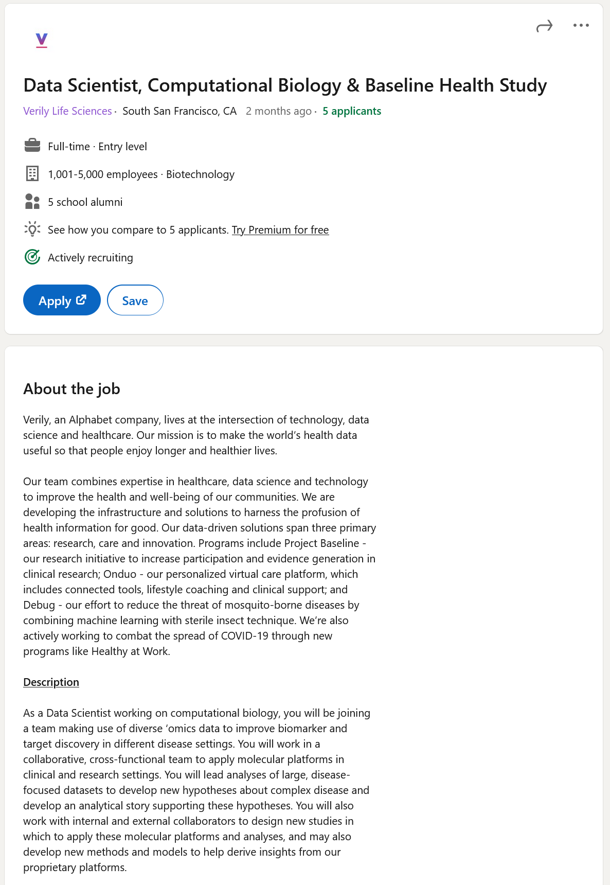
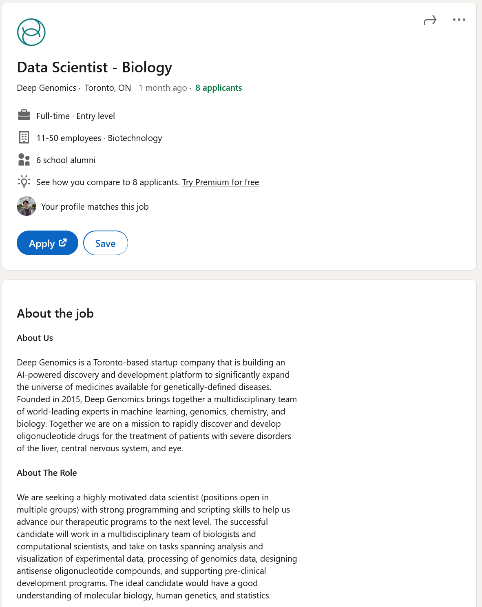
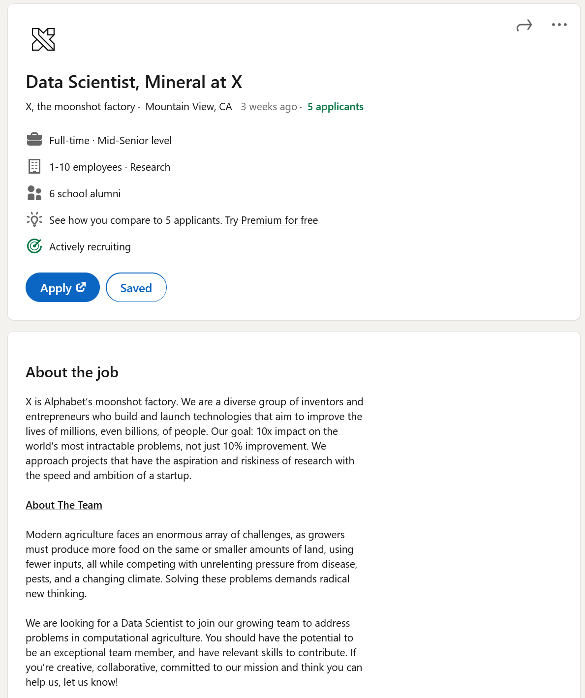

# Task 1: Data Science Careers

## job 1: Verily Life Sciences, an Alphabet Company

[Job link](https://www.linkedin.com/jobs/view/2759552399/)

Verily Life Sciences is an Alphabet company that seeks to apply technology and data science to healthcare. Naturally,
the data type and topics are of my interest as a CS/Bio student and currently working at a computational
neuroinformatics lab. I enjoy working with 'omics data and would love to have a job opportunity in the industry that
uses them.

Screenshot of posting: 

## job 2: Deep Genomics

[Job link](https://www.linkedin.com/jobs/view/2808479938/)

Deep Genomics is a startup seeking to integrate ML, genomics, and chemistry together to develop oligonucleotide drugs.
I am currently working with epigenetic and genetic data and find it quite enjoyable. This opportunity would be the 
chance to explore how drug design, genetic data analysis is done at an industrial level compared to my 2 years of 
genetic analysis in an academic setting.

Screenshot of posting: 

## job 3: X Development LLC

[Job link](https://www.linkedin.com/jobs/view/2780742047/)

X is a R&D company under Alphabet that explores ambitious "moonshot" projects. some well known examples include 
Google Glasses, Waymo self-driving technology, Google Watch, and Google Brain. X is looking to tackle the field of
'computational agriculture' and work with agronomic crop trait and yield data, applying ML and statistical techniques
to guide decision making teams. Given the wild exploration and intersectional products by X, the job opportunity gives
an exciting opportunity to have colossal impact with data science; it fits my career interest as a CS/Biology student

Screenshot of posting: 

# Task 2: Highs and Lows

## What were the highlights of the class for you?

Very applied projects and relatively light workload due to the weekly assignment structure. A nice break from my other
500 level courses due to this course being designed as an intro 200-300 level course.

## What could have been done better? How?

I wish the course assumed COMP 206 as a prerequisite so that the first ~5-6 weeks can be skipped and instead spent on
going deeper into a few select topics that were very much skimmed on. Many students who have taken COMP 250 would have
also taken COMP 206 for their degree; the course spent too much time early reintroducing background concepts not directly
linked to data science.
 
1-2 more advanced projects involving active use of AWS servers or  SQL-related database would have been phenomenal.
Quite frankly, AWS was severely underutilized considering how many jobs pertaining to data science ask for AWS/Azure
experience.